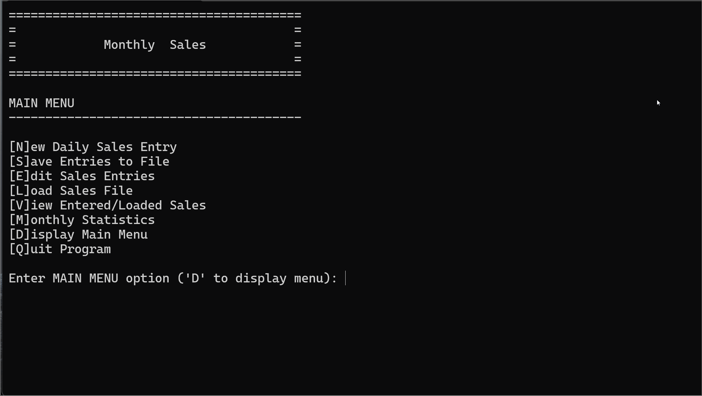

# Fall 2024 Assignment 03 - Methods, Arrays, and File I/O
__Weight:__ 15% of final mark

__Submission requirements:__ On or before the deadline, commit a Visual Studio 2022 project to the GitHub repository. __You must commit and push to the classroom repository supplied for the assignment__; do not create your own repository. It is your responsibility to ensure that your work is in the correct repository. ___Work not in the repository will not be graded___.

## Context
A friend of yours runs a food truck. They need help building a sound financial picture of how their small business performs every month. They shared with you that it would be nice to have a program that could produce some basic sales stats for them to review, such as the average daily sales, highest sales day, lowest sales day, etc. After hearing about their plight, you offer your expertise to help them by building a program to help them out. It should be simple enough ...

### Requirements

Your program must meet the following requirements:

- Must allow the user to **enter** sales amount per day
- Must allow the user to **save** their entered daily sales to a file
- Must allow the user to **load** a previously saved daily sales file
- Must allow the user to **view** and **edit** previously entered sales values
- Must allow the user to view simple **analysis** of the currently entered/loaded data:
  - Mean average sales
  - Highest daily sales amount
  - Lowest daily sales amount
  - Chart of daily sales for the current month

## Implementation Details 

You will be provided with a starter project for this assignment ([Assignment3Starter](./Assignment3Starter/)). Your job will 
be to complete the missing requirements where indicated. There are a number of tasks that are all identified by 
`// TODO: ` comments throughout the `Program.cs` file.

The program makes use of a main menu for top-level options and a sub-menu for the analysis options. The
program should continue to run until the user chooses to quit the program. Ask the user to supply the 
desired filename when saving a new monthly sales file. When entering new sales data, the user will need to enter new sales values for one month only and provide a value for each day in the month (days with no sales will be recorded as zero); there is no requirement for appending values into already partially filled arrays. Ensure that date values are in valid MMM-dd-yyyy (e.g., FEB-21-2024) format and that sales values are zero or positive.

Use two parallel arrays for storing the data in your program (one for date values and one for
corresponding daily sales values). Keep an accurate record count for the number of days of data that have
been loaded/entered.

Ensure that duplicate entry dates (when entering data) are not allowed; there should only be one sales value
per date.

The format of the sales data files should be as follows (assume valid file format for input):
- Include a header record with the following headings: Date and Sales
- Sales results are recorded to two decimal places
- Data files must include the date in MMM-dd-yyyy format and be ordered in ascending date order:

```sh
Date,Sales
FEB-01-2024,546.50
FEB-02-2024,0.00
FEB-03-2024,416.75
FEB-04-2024,674.25
...
FEB-29-2024,339.25
```
_Sample data file format_

You will use a modular approach when constructing this program. Ensure that, at a minimum, the
following methods are present and used (difficulty level is rated 1-easy, 2-moderate, 3-challenging, 4-extreme):

- `void DisplayMainMenu()` --> displays the main menu options [difficulty 1]
- `void DisplayAnalysisMenu()` --> displays the analysis menu options [difficulty 1]
- `string Prompt(string promptString)` --> displays the prompt string and returns user-entered string
(allow empty string to be returned) [difficulty 1]
- `double PromptDouble(string promptString)` --> displays the prompt string and returns user-entered
double (ensure that the program does not crash and always returns a valid double value)
[difficulty 1]
- `int HighestSales(double[] sales, int countOfEntries)` --> returns the index of the _highest_ sales amount in the sales array
(requires that the original ordering of the arrays be retained) [difficulty 1]
- `int LowestSales(double[] sales, int countOfEntries)` --> returns the index of the _lowest_ sales amount in the sales array
(requires that the original ordering of the arrays be retained) [difficulty 1]
- `double MeanAverageSales(double[] sales, int countOfEntries)` --> returns the mean average of the _daily_ sales; include all days for the month (yes, even days with zero sales) [difficulty 1]
- `int EnterSales(double[] sales, string[] dates)` --> allows the user to enter dailys sales entries (dates
and sales values) into the arrays; returns the number of entries entered [difficulty 2]
- `int LoadSalesFile(string filename, double[] sales, string[] dates)` --> loads the records from a file
(filename) into the associative arrays used by the program; returns the record count (i.e. how
many days of data were loaded) [difficulty 2]
- `void SaveSalesFile(string filename, double[] sales, string[] dates, int countOfEntries)` --> writes the
associative array data to a file (filename) in the correct format [difficulty 2]
- `void DisplayEntries(double[] sales, string[] dates, int countOfEntries)` --> displays the current entered/loaded sales entries
in a formatted table (i.e. ensure that proper columns and alignment are used). __You must use a for
loop to loop through the arrays and produce the display__ [difficulty 2]
- `void EditEntries(double[] sales, string[] dates, int countOfEntries)` --> allows the user to view all current
entries and choose one to edit (i.e. overwrite) [difficulty 3]
- `void DisplaySalesChart(double[] sales, string[] dates, int countOfEntries)` --> displays a chart
of the sales data in the following format:

```
=== Sales for the month of February ===

Dollars
    700|
    650|                           $675
    600|
    550|
    500|  $546
    450|
    400|                  $416
    350|
    300|                                        $339
    250|
    200|
    150|
    100|
     50|
      0|           $0
    -----------------------------------       ------
  Days |    01     02       03       04  ...      29
```
Use the maximum value in the sales array to determine the y-axis markers (count by 50s for the y-axis values) and the dates
for the x-axis. In the chart above, the ellipsis (...) is used for demonstration only, include all days in your 
implementation. [difficulty 4]

The program should never crash and must deal with errors gracefully.

__Aside from what’s been presented in this document, do not make any assumptions. Seek clarity from
your instructor if you do not understand something in this document.__

## Coding Requirements
- A C# comment block at the beginning of the source file describing the purpose, author, and last modified date of the program
- Write only one statement per line
- You must use two corresponding/parallel arrays for sales and dates in your solution
- You must not use built-in methods for finding the average, high, and low values in arrays
- Use camelCase for local variable names
- Use TitleCase for any constant variable names
- Use defensive programming where necessary
- Ensure graceful handling of exceptions
- All methods must be defined as static methods
- Include summary comments for all defined methods (these must be complete and include param and returns where appropriate)

### Sample Runs

#### Sample Program Run
_NOTE: the sample runs do not demonstrate exception handling, ensure your program handles exceptions gracefully and does not crash._

#### Enter values, perform analysis, and save file


#### Load file and edit entries


## Submission
Commit and push your solution to your GitHub classroom assignment repository before the deadline. Ensure that your solution follows the best coding and style practices, as your instructor has shown you in class. Failed adherence to the prescribed style guidelines may result in lost marks. __Your program must compile; a program that fails to compile will not be graded.__

_NOTE: push early and often to your repository to receive feedback from your instructor prior to the deadline. Your instructor will not be providing feedback for every commit every day. However, the earlier and more often you commit, the greater the chances of your instructor reviewing your work and providing constructive feedback that you can act on before the deadline._

## Rubric [25 Marks Total]
### Program Completion and Modularization
| Mark | Description |
|---|---|
| 15 | **Outstanding**: program exhibits all requirements for Excellent as well as completion of difficulty 4 method. |
| 13-14  | **Excellent**: program implements, at a minimum, all seven difficulty 1 methods, all four difficulty 2 methods, 1 difficulty 3 method (total 12). Methods are correctly implemented, including proper documentation comments, and are called appropriately in the main program. Functionality of each method is correct and each task is fully implemented (e.g. returns expected values, proper file read/write, proper array management, etc.). |
| 10-12  | **Very Good**: program implements, at a minimum, six difficulty 1 methods, three difficulty 2 methods, 1 difficulty 3 method (total 8). Methods are correctly implemented, including proper documentation comments, and are called appropriately in the main program. Functionality of each method is correct and each task is fully implemented (e.g. returns expected values, proper file read/write, proper array management, etc.). |
| 7-9  | **Acceptable**: program implements, at a minimum, five difficulty 1 methods and three difficulty 2 methods (total 7). Methods are correctly implemented, including proper documentation comments, and are called appropriately in the main program. Functionality of each method is correct and each task is fully implemented (e.g. returns expected values, proper file read/write, proper array management, etc.) |
| 4-6  | **Needs Work**: program implements, at a minimum, three difficulty 1 methods and two difficulty 2 methods (total 5). Methods are correctly implemented, including proper documentation comments, and are called appropriately in the main program. Functionality of each method is correct and each task is fully implemented (e.g. returns expected values, proper file read/write, proper array management, etc.) |
| 1-3  | **Unsatisfactory**: program implements, at a minimum, two difficulty 1 methods and 1 difficulty 2 method (total 3). Methods are correctly implemented, including proper documentation comments, and are called appropriately in the main program. Functionality of each method is correct and each task is fully implemented (e.g. returns expected values, proper file read/write, proper array management, etc.). |
| 0  | **Not done**; poorly attempted; program implements none (0) of the required methods. |

### Array Implementation
| Mark | Description |
|---|---|
| 5  | **Excellent**: program implements and correctly uses both associative arrays; correct elementcount is kept; arrays are correctly loaded and traversed for output, including analysis algorithms (e.g. finding the average value) |
| 4  | **Very Good**: program implements and correctly uses both associative arrays; element count is always accurate; arrays are correctly loaded and traversed for output; analysis algorithms may contain a minor error |
| 3  | **Acceptable**: program implements and correctly uses both associative arrays; element count is accurate in most cases; arrays are correctly loaded and traversed for output in most cases; analysis algorithms may contain minor errors |
| 2  | **Needs Work**: program implements and uses both associative arrays; element count is not accurate; program suffers from minor error(s) when loading or traversing arrays for output; analysis algorithms not implemented or contains major error(s) |
| 1  | **Unsatisfactory**: program implements and uses only one array; element count is not accurate; program suffers from major error(s) when loading or traversing arrays for output; analysis algorithms not implemented or contains major error(s) |
| 0  | **Not done**; poorly attempted; major logic errors; major design problems; program does not implement any arrays. |

### FileI/O Implementation
| Mark | Description |
|---|---|
| 5  | **Excellent**: program correctly reads and writes files as required by the program specifications; errors when reading/writing files will not crash the program; required CSV file format is implemented for written files; defensive programming techniques are applied when appropriate |
| 4  | **Very Good**: program correctly reads and writes files as required by the program specifications; errors when reading/writing files will not crash the program; required CSV file format is implemented for written files with minor error(s); defensive programming techniques are applied in some cases |
| 3  | **Acceptable**: program correctly reads and writes files as required by the program specifications; errors when reading/writing files will crash the program in most cases; required CSV file format is implemented for written files with minor error(s); defensive programming techniques are not applied in most cases |
| 2  | **Needs Work**: program reads or writes files with slight error(s); errors when reading/writing files will crash the program; required CSV file format is not implemented; defensive programming techniques are not applied |
| 1  | **Unsatisfactory**: program only reads or writes files with; program reads or writes to files with errors; errors when reading/writing files will crash the program; required CSV file format is not implemented; defensive programming techniques are not applied |
| 0  | **Not done**; poorly attempted; files are neither written or read by the program |
